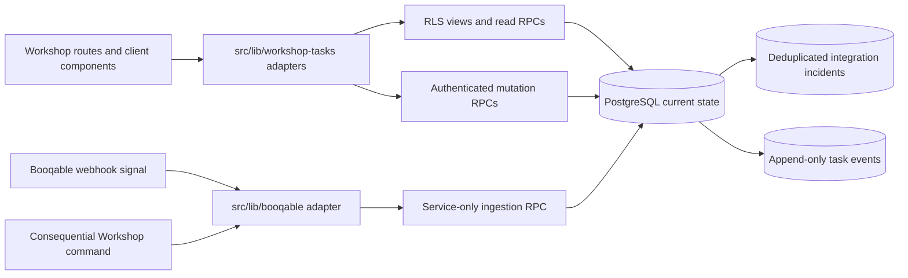
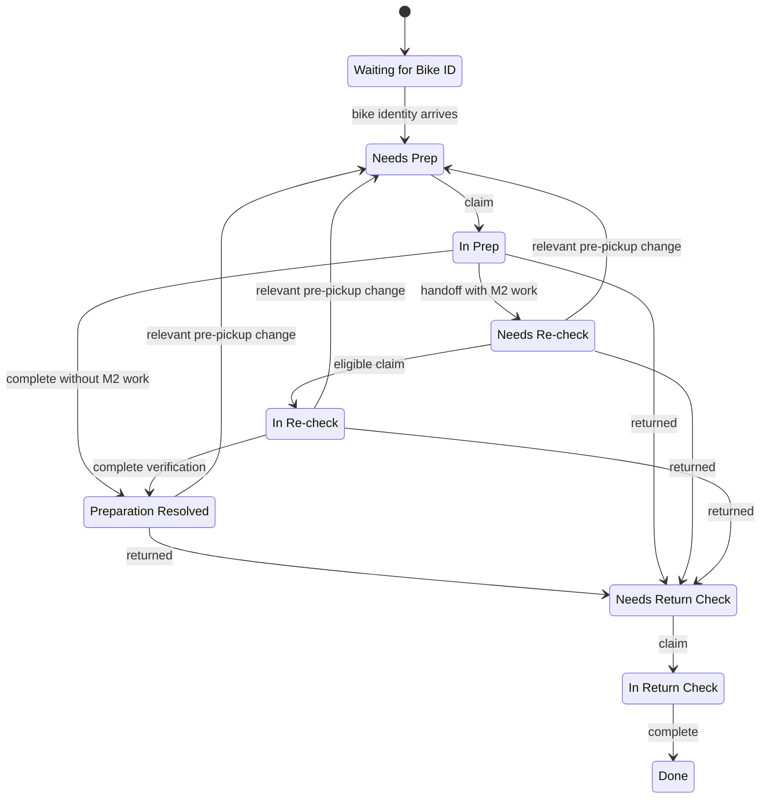
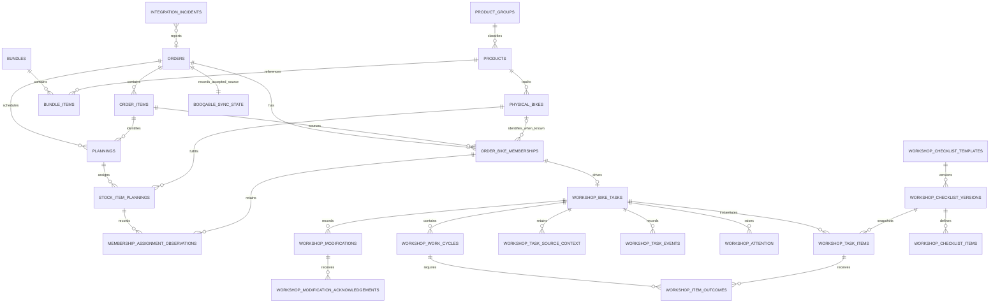

# Architecture Spine — Workshop Tasks

## Design Paradigm

**Transactional modular monolith.** Next.js owns presentation and authenticated adapters; PostgreSQL owns atomic workflow decisions. Booqable is isolated behind one normalization adapter that evolves the app's existing shared order persistence rather than creating a second Workshop projection.

The architecture commitment is final and its prior research ambiguities are resolved by verified contracts or safe v1 re-scopes. The PRD's FR-1, FR-3, and Setup fallback were aligned on 2026-08-12; source-first Booqable tag classification and E-MTB were aligned on 2026-08-14. Production activation remains conditional on seeded and validated Product/ProductGroup/Bundle tags, account lifecycle/archive fixtures, technology and security containment, production privilege/environment proof, complete caller cutover, measured operating proof, exact JIT freshness, and zero blocking incidents. Broad `review_updated_configuration` is the initial mode; targeted Setup mapping is an Epic 6 concern.



Dependencies point inward. Workshop code may depend on the normalized integration contract; it may not call Booqable or parse Booqable payloads. PostgreSQL functions may not perform external HTTP.

## Invariants & Rules

### AD-1 — Keep Booqable and Workshop Tasks in separate modules [ADOPTED]

- **Binds:** all
- **Prevents:** Booqable response shapes leaking into task screens, lifecycle code, or checklist stories.
- **Rule:** `src/lib/booqable` alone fetches, validates, and normalizes Booqable data. `src/lib/workshop-tasks` and `/workshop` consume local tables, views, and RPC contracts only.

### AD-2 — Put multi-record workflow changes behind database transactions [ADOPTED]

- **Binds:** FR-5, FR-8..FR-10, FR-18, FR-20..FR-25, FR-37..FR-48; NFR-4, NFR-6
- **Prevents:** a lifecycle stage changing without its assignment, outcomes, revision, or history changing with it.
- **Rule:** every multi-row domain mutation is one named PostgreSQL RPC. The RPC validates the transition and commits current state plus audit together or rolls everything back. Server actions are `withAuth` adapters and contain no parallel workflow implementation.

### AD-3 — Keep one shared canonical Booqable projection [ADOPTED]

- **Binds:** FR-1..FR-3, FR-12, FR-15, FR-19, FR-26..FR-36, FR-39, FR-47
- **Prevents:** a parallel Workshop order model, two writers disagreeing, raw Booqable JSON becoming domain state, or source cleanup breaking task history.
- **Rule:** evolve the existing shared `customers`, `orders`, and `order_items` relations additively and preserve their bookings, orders, and partner-attribution consumers. The same canonical integration boundary admits only the minimum contracted Workshop graph: tagged bike ProductGroups/Products; matching tagged Bundles/BundleItems only when required; Plannings; StockItemPlannings; physical StockItems; immutable historical order-bike memberships; source-version state; and deduplicated integration incidents. Persist `tag_list` for every admitted Product, ProductGroup, and Bundle as a one-way read-only Booqable source fact. These are shared source/operational facts—not a Workshop copy and not a generalized warehouse. The Booqable integration module owns projected source fields, order-bike memberships, and assignment observations; its coordinator is the sole membership writer and invokes Workshop-owned task derivation inside the same transaction. Workshop owns task lifecycle, task-specific attestations, and app-authored modifications. The ingestion capability is the sole writer of source-owned fields after expand → switch → contract; separate local-customer capability cannot write them. Referenced source roots and historical assignments become inactive/closed rather than cascade-deleted only under resource-specific archive contracts. Store no permanent raw-payload mirror, durable application replay state, or unadmitted resource.

### AD-4 — Reconcile one canonical order snapshot atomically [ADOPTED]

- **Binds:** FR-1..FR-4, FR-26..FR-33, FR-39, FR-47; NFR-3
- **Prevents:** duplicate tasks/events, partial order-item updates, and stale Booqable responses regressing accepted work.
- **Rule:** a webhook or consequential caller only identifies an order to refetch; its body is never projected as source truth. The adapter emits AD-16's contract. Every `order_graph` relationship scope declares `complete` or `partial`, but generic absence is permanently non-closing in v1 even when transport-complete. A source child may close only from a validated explicit archive/tombstone or another independently fixture-proven explicit removed state returned through the canonical refetch path; a versioned resource-removal registry names the exact Booqable resource/operation, authority token, canonical fetch profile, and domain consequence allowed to do so. An independently versioned child tombstone may authorize its own closure without any assumed parent `updated_at` advance; otherwise removal requires fixture-proven newer relationship authority plus explicit removed state. A new component is admitted only under the producer profile's fixture-proven newer relationship authority or an approved independently versioned child-creation token; unauthoritative additions quarantine with no source/Workshop mutation. Omitted accepted components carry forward their accepted state/version, open or refresh an incident, and cannot close or regress; independent newer components may still apply atomically. Source vectors and semantic fingerprints compare the canonical merged effective state after carry-forward, while omission observations/incidents remain outside that fingerprint. Equal vector plus equal fingerprint is `no_op`; equal vector plus different fingerprint, any older present component, or unresolved present-component incomparability is `quarantined` with no mutation. A failed refetch, validation, comparison, or ingestion call performs no canonical or Workshop-domain mutation. PostgreSQL atomically applies accepted source plus Workshop derivation. Every comparator and omission branch requires fixtures.

### AD-5 — Preserve source and physical-bike identity [ADOPTED]

- **Binds:** FR-1..FR-3, FR-7, FR-35, FR-37, FR-39
- **Prevents:** history moving to another bike, provisional work being recreated, or removed source rows deleting workshop history.
- **Rule:** membership identity is `(order_external_id, line_external_id, source_unit_discriminator, replacement_chain_incarnation)`, protected by a unique constraint and represented by one immutable local UUID; an immutable predecessor edge serializes the replacement chain, and replacement closes the prior current member before opening exactly one successor in the same transaction. At most one Bike Task exists for each membership lifetime. A quantity-one line may use provisional discriminator `single`; Planning, current StockItemPlanning, and physical-bike references are nullable assignment observations until exact StockItem promotion, which updates observations without changing membership identity and preserves remap history. A multi-quantity line admits memberships/tasks only for exact distinct StockItem assignments, using physical StockItem external ID as discriminator; Planning and StockItemPlanning IDs remain observations and array position/generated ordinal are forbidden. Planned quantity greater than assignments creates one deduplicated `identity_shortfall` incident and no guessed task. Assignments greater than accepted quantity quarantine the conflicting graph. One StockItem may serve sequential rentals, but cross-order memberships use authoritative half-open intervals `[rental_starts_at, rental_ends_at)` under a StockItem-keyed lock: overlap or unknown interval authority quarantines every affected graph with one blocking incident, while terminal/removed task state does not waive the conflict before source rental end. Same-stock planning remap preserves identity. A different StockItem closes the current member and creates the next linked incarnation; post-Replaced re-add does the same. Same order/line/StockItem reappearance after Done or Force-closed remains incident-only; until a versioned source-backed new-rental identity profile passes positive, negative, and replay fixtures, only a new order/line identity or AD-14 correction successor may create work. Referenced roots/rows are retained with restrictive deletes.

### AD-6 — Store explicit lifecycle state and explicit Work Cycles [ADOPTED]

- **Binds:** FR-4..FR-10, FR-18, FR-20..FR-33, FR-39..FR-45
- **Prevents:** different stories deriving incompatible stages or overwriting earlier M1/M2 attribution.
- **Rule:** `workshop_bike_tasks` stores the ordinary workflow stage, a separate reversible source-availability overlay (`active`, `temporarily_removed`, `cancelled`), and an optional irreversible terminal outcome (`replaced`, `force_closed`). Done is final. Explicit order cancellation sets `cancelled`; fixture-authorized Planning/StockItemPlanning removal sets `temporarily_removed`; both preserve safe stage/evidence, pause the cycle, and atomically clear assignment. Same-stock re-add clears the overlay and returns unassigned; different-stock replacement closes the old membership/task and creates the linked successor. Manager reset, source invalidation back to Needs Prep, forced Return, replacement, force-close, and Done also clear assignment atomically; handoff ownership remains cycle-scoped. Return forcing applies only to a currently associated, Return-eligible membership; cancelled/removed work cannot enter Return until authoritative reassociation clears the overlay, and Replaced never reactivates. Only transition RPCs may change this tuple after checking confirmed evidence, assignment, source state, revision, and completion gates. Post-pickup changes never reopen Prep.



Work Cycle boundaries are canonical: initial actionable Prep opens one cycle; source changes during active M1 Prep advance affected generations within it; a first relevant change from Re-check or Preparation Resolved closes the prior cycle and opens one new Prep cycle. Further accepted refreshes while that source-driven Prep work remains unresolved converge to latest intent inside the already-open cycle—no extra reset/cycle—unless another explicit lifecycle boundary is crossed. Manager reset closes/replaces the cycle; removal/cancellation pauses it; forced Return, replacement, force-close, and Done close it. Reassignment preserves outcome actors. The mechanic performing accepted handoff becomes that cycle's M1 for M2 independence. A two-person override targets exact cycle, M1, Re-check phase, and expected revision; approval is consumed by that cycle's authorized same-mechanic assignment and expires on cycle/M1/stage/terminal change. Needs Attention is not lifecycle state.

### AD-7 — Freeze checklist definitions and preserve outcome generations [ADOPTED]

- **Binds:** FR-11..FR-25, FR-28..FR-33, FR-39..FR-42
- **Prevents:** template edits rewriting existing work or reopened Items erasing prior attestations.
- **Rule:** drafts are editable; activated versions are immutable and referenced versions cannot be deleted. Activation and every Prep/Return snapshot selection acquire the same transaction advisory lock derived from `(bike_category_id, phase)` before reading/updating the active pointer, version Items, category links, and built-ins; a uniqueness constraint maintains exactly one active version. Missing active versions block. Activation validates structure but never requires Setup Category coverage; gaps are non-blocking context. Workshop-owned immutable definitions inject stable `extra_information_confirmation` (active required M1/M2) and `review_updated_configuration` (dormant until ambiguous change) identities into every Prep snapshot; admins cannot edit/delete them. Action outcomes are distinct Done/N/A. Required Values require a value, optional Values may remain blank, and Values never offer N/A. M2-enabled implies M1-enabled; M2 records fresh resolution/verification. Admin Items remain visible; category links control context/invalidation, not visibility. Each Item save supplies task workflow revision, exact active requirement/source generation, expected evidence revision, and idempotency key. Unchanged workflow guards allow disjoint saves to commute; same-generation evidence uses compare-and-set, every accepted edit advances evidence revision, and superseded evidence remains audit. Accepted mechanic evidence advances the last-physically-attested baseline only for the requirement/role/generation it satisfies. Later source refreshes supersede/converge unresolved active generations to latest intent without changing prior evidence. Transitions lock/re-read all active evidence.

### AD-8 — Keep current state and append-only history together [ADOPTED]

- **Binds:** FR-5, FR-8, FR-10, FR-16..FR-25, FR-33, FR-37..FR-46; NFR-6
- **Prevents:** slow event replay for ordinary screens and editable audit evidence.
- **Rule:** normalized current-state tables power reads. Every accepted claim, assignment/reassignment, outcome, handoff, verification completion, invalidation, lifecycle change, modification, attention action, override, reset, replacement, cancellation, and force-close inserts attributable history in the same transaction. Events contain exactly one authenticated actor or explicit system source, resulting domain revisions, an immutable per-task sequence allocated under the task lock, and a database monotonic global sequence; only per-task sequence is causal, while `(occurred_at, global_sequence)` provides deterministic cross-task presentation. Direct event `INSERT`, `UPDATE`, `DELETE`, and `TRUNCATE` are revoked from application roles including service role; only narrowly owned domain functions insert. Parent deletion is restricted. Current state is not rebuilt by replay.

### AD-9 — Reject stale work with explicit revisions [ADOPTED]

- **Binds:** FR-9, FR-18, FR-28..FR-33, FR-42, FR-43, FR-48; NFR-4, NFR-5
- **Prevents:** an old tablet screen overwriting a newer assignment, configuration, or lifecycle state.
- **Rule:** task workflow revision covers actionability, assignment, lifecycle/terminal state, current cycle, and active source/requirement generations; Item evidence, Notes, attention, and modifications use their own compare-and-set revisions. Workflow mutations supply expected revision and accepted changes increment it; Item saves guard that revision/generation but do not invalidate disjoint Item saves, while every evidence edit advances its evidence revision. No-ops/rejections do not increment. Transitions lock/re-read confirmed evidence and acknowledgements rather than trusting a progress counter. Mismatches return stable code plus current revisions, stage, overlay, and assignee. Claims require availability, stage, unassigned state, role eligibility, and M2 independence, so first valid writer wins. Total lock order is order sync → shared resources sorted by `(resource_type, external_id)` → memberships/tasks sorted by local UUID → cycles/requirements/evidence/context sorted by stable ID → orthogonal records → events; dynamically discovered rows re-enter that same total order or cause a bounded retry.

### AD-10 — Keep orthogonal records orthogonal [ADOPTED]

- **Binds:** FR-34, FR-37..FR-45
- **Prevents:** attention blocking mechanical completion, Notes becoming an audit ledger, or modification acknowledgement overwriting the modification.
- **Rule:** lifecycle, Notes, Structured Modifications, Return acknowledgements, found-and-fixed records, and attention are separate. First-release mechanic attention reason codes are `same_mechanic_recheck_override`, `missing_or_unclear_bike_order_information`, and `manager_decision_needed`. The override carries no explanation or resolution note and blocks only the requester from that Re-check; the latter two require a short creation explanation and manager resolution note while remaining otherwise non-blocking. Open identity is `(task, source, reason_code, cycle_id when cycle-scoped)`; repeats correlate the same open issue and resolution preserves attribution/history. Found-and-fixed requires a short factual description, writes Activity only, and opens no attention. Integration incidents attach to a task only through trusted identity. Compound manager commands validate cycle/M1/revision and atomically resolve/apply any override/assignment. Notes remain one mutable latest value; Structured Modifications are durable and each Return-generation acknowledgement is separate.

### AD-11 — Use RLS for reads and capability RPCs for writes

- **Binds:** FR-6..FR-10, FR-11, FR-37..FR-46; NFR-7
- **Prevents:** client role checks becoming authorization and direct writes bypassing transition/audit rules.
- **Rule:** Workshop-owned relations/read models expose RLS reads only and exclude `partner`; use `security_invoker` views where underlying RLS is sufficient. Shared canonical customers/orders/items retain existing partner-scoped access but expose no Workshop state. Mechanics never gain broad shared-table RLS; a narrowly owned definer read capability verifies staff role/task scope and returns AD-18's task-context contract. Non-login object-owner roles own relations. Separate non-login `BYPASSRLS` capability roles receive only needed privileges and own internal definer functions in an unexposed schema; exposed RPCs are thin wrappers. The integration coordinator owns source projection and invokes a Workshop-owned derivation function in the same transaction; it receives no general Workshop-table grant. User capabilities mutate only their aggregates; local-customer creation is separate; event capability roles insert but never own/update/delete/truncate. Functions use `search_path = ''`, schema-qualified objects, and internal actor/scope checks. Revoke schema/table/sequence/function privileges from `PUBLIC` in the same migration transaction; apply locked `ALTER DEFAULT PRIVILEGES` for every migration/object-owner role; prohibit API-role membership or `SET ROLE` into owner/capability roles; then grant minimum execution. API roles including service role retain no direct authoritative source/event DML after cutover. Privilege fixtures execute allowed and denied paths as `anon`, `authenticated`, and `service_role`.

### AD-12 — Serve database read models; refresh from authority

- **Binds:** FR-6, FR-15, FR-22, FR-33..FR-38, FR-41, FR-43, FR-46; NFR-1, NFR-2, NFR-4, NFR-5, NFR-8
- **Prevents:** Node/React aggregation drift, client state becoming workflow truth, and empty results hiding read failures.
- **Rule:** queues, confirmed progress, manager attention, Activity, same-stock last-touch, and unresolved integration incidents are `security_invoker` views or read RPCs. Task detail composes Workshop RLS reads with AD-11's field-minimized task-context capability; it never broadens mechanics' base customer/order access. Loaders return data plus `error`; last-touch uses `{ touch: null, error: null }` for successful no-result. Search, pagination, and filters use URL parameters; identity uses dynamic routes. Every consequence-bearing control shows in-context pending/error state, prevents repeat submit, and shows success only after server confirmation. Item failures retain open-screen input; lifecycle commands flush/await pending saves, use confirmed evidence only, and remain pending until authoritative rendered state confirms them. Realtime only triggers authoritative refresh.

### AD-13 — Fail closed at the Booqable mapping boundary

- **Binds:** FR-1..FR-3, FR-15, FR-19, FR-26..FR-36, FR-39, FR-47; NFR-3
- **Prevents:** fragile title matching and a Booqable API shape change silently producing wrong physical work.
- **Rule:** validate fetched API v4 data before ingestion; the form-encoded, v1-shaped webhook body remains a signal only. Map bike category, Setup Categories, bundle/parent links, Plannings, StockItemPlannings, StockItems, and rental phase only through stable identifiers/fields and versioned producer profiles that define request/include/pagination completeness, source-version extraction, null/unknown rules, fingerprint inputs, and permitted explicit removals per resource. The documented nested-order path is mandatory; standalone inventory reads remain an unverified optimization until separately contracted. Bike category uses the controlled ProductGroup tag vocabulary: `workshop-road-bike`, `workshop-e-road-bike`, `workshop-e-city-bike`, `workshop-gravel-bike`, `workshop-mtb-bike`, and `workshop-e-mtb-bike`. Bundles use the corresponding `workshop-*-bike-bundle` tag and must agree with the contained bike ProductGroup; Products inherit the ProductGroup tags. Persist tag lists for all admitted Products, ProductGroups, and Bundles. Exactly one controlled ProductGroup bike tag admits category; untagged entities create no Workshop work, while unknown, multiple, conflicting, or bundle-disagreeing Workshop tags fail closed with an Integration Incident. Labels never classify. Tags do not replace exact StockItem identity. Per-bike phase derives from exact Planning/StockItem context as assigned-not-started, started-not-stopped, or stopped; it remains `unknown` until target-account fixtures cover reserved, partial/full start, partial/full stop, cancellation, removal, and re-add. Once proven, exact per-bike `stopped` makes that bike Return-eligible without waiting for whole-order stop; contradictory order/bike facts fail closed with an incident. Broad Setup invalidation is the initial mode. Accessory tags remain persisted but uninterpreted until Epic 6; targeted invalidation activates only when every active Setup Category has stable source identifiers and fixture-backed normalization. Broad mode fingerprints every admitted normalized configuration, accessory, `extra_information`, and null/unknown/removed state exposed by AD-18; the first baseline does not invalidate, every later semantic change advances `review_updated_configuration`, and broad↔targeted changes require disabled rebaseline. Title/label matching is forbidden.

### AD-14 — Roll out and verify through the existing operational envelope

- **Binds:** all; NFR-3, NFR-6, NFR-7
- **Prevents:** dependent Workshop stories binding to an unstable source contract, Vercel timeouts, manual remote schema drift, and paper retirement before critical rules are verified.
- **Rule:** sequence delivery as recorded documentary closure plus security/technology containment → integration foundation → existing-caller cutover → dependent Workshop callers → environment proof → pilot/activation. The 2026-08-12 PRD closes FR-1 and FR-3; the 2026-08-14 correction closes source-first bike classification and confirms broad Setup fallback as the initial mode. Before task derivation, seed and validate all six ProductGroup tags, their corresponding Bundle tags, Product inheritance, bundle agreement, untagged exclusion, and fail-closed incident branches. Containment ratifies one environment-managed static webhook secret for v1, compares it without disclosure, rotates it through environment management, and always refetches authority; it also removes or strongly authenticates and least-privileges the service-role sandbox route, applies `@supabase/ssr@0.10.0` cache-prevention headers, and independently migrates Next.js 14 through a currently supported-LTS compatibility path. The existing secret-protected, preview-denied `GET /api/sandbox/booqable/sync-orders` is retained as a temporary legacy exception: it refetches Booqable authority through the existing sync path and does not directly edit source or task tables. It is neither a new per-order/manual recovery API nor a retry queue, worker, Cron job, or reconciliation system; retire or further contain it only through a future explicitly approved replacement-or-removal decision. Pin Node 24.x, its type surface, and one locally tested stable Supabase CLI in source and CI; verify a migration-owned required PostgreSQL extension manifest, hosted capability-role creation, auth/build/PDF/editor/email/routes, and effective-role plus multi-session tests before foundation expansion. Preview/branch deployments receive no Booqable/service-role credentials and cannot ingest, derive, or activate. Cut over a versioned caller register before revoking legacy DML. Deployment is local proof → staging disabled proof → production disabled → production shadow/privilege proof → explicit production pilot → general activation. Before pilot, one operator-triggered pre-pilot validation refetches and atomically evaluates the approved cohort against the accepted source contract; it records the resulting materialization evidence and deduplicated incidents, without establishing a recurring recovery process. Faulty irreversible derivation never edits the false terminal row: an admin-only exposed RPC backed by a separate internal correction capability locks the false predecessor and creates at most one immutable successor edge per false predecessor, independent of epoch or idempotency key; idempotency deduplicates request replay only, concurrent losers return the existing successor, and later correction must target the current successor rather than branch from the original. `anon`, mechanics, managers, `service_role`, and the integration coordinator cannot execute it. Remote DDL remains CI-only.

Mandatory proof under this AD is one package: adapter fixtures for the six ProductGroup tags, corresponding Bundle tags, Product inheritance, bundle agreement, untagged exclusion, and unknown/multiple/conflicting Workshop-tag branches; quantity-one provisional promotion; multi-quantity partial/exact assignment, same-stock remap, different-stock replacement, removal, and re-add without ordinals or duplicates; lifecycle phases; explicit archives; non-closing absence; partial scopes; and unsupported schema. pgTAP covers envelope/result vocabulary, every comparator branch, source/derivation/event rollback, atomic failure non-mutation, identity/cardinality/incarnation, lifecycle and FR-3, revisions, append-only events, and effective-role permissions. A true multi-session harness covers concurrent claims, overlapping ingestion, and template activation versus snapshot selection. The pinned CLI must pass local reset, `supabase test db`, lint, and generated-type checks. Environment proof must assert SSR refresh emits `Cache-Control: private, no-store` and resolve or explain the prior staging extension-query timeout. Before pilot, approve an emergency-disable and incident-handling procedure that retains evidence and names correction-successor use; emergency direct database intervention is outside supported guarantees and is not an operating procedure. Pilot, general activation, and paper retirement are separate approvals.

### AD-15 — Require authoritative JIT freshness at consequential boundaries [ADOPTED]

- **Binds:** FR-1..FR-4, FR-15, FR-19, FR-26..FR-39, FR-47; NFR-3, NFR-4, NFR-6
- **Prevents:** a webhook body becoming source truth, stale source state authorizing a consequential action, operators repairing source rows by hand, or different callers applying different freshness rules.
- **Rule:** every webhook and every consequential Workshop caller uses AD-16 to refetch Booqable authority and atomically ingest the resulting graph. A webhook call is best-effort: if it fails, it creates or refreshes only a deduplicated incident and performs no canonical or Workshop-domain mutation. Each consequential JIT call fetches after the caller begins and may authorize its action only when that exact call returns `applied` or `no_op` with AD-16's current freshness proof. No attempt generation, durable replay state, delayed execution, or background recovery path supplements this requirement. Ordinary Item saves, Notes, attention, modifications, and templates remain local-only; transitions re-read them after JIT. No path directly patches source/task tables.

### AD-16 — Bind one versioned integration envelope [ADOPTED]

- **Binds:** FR-1..FR-4, FR-15, FR-19, FR-26..FR-39, FR-47; NFR-3, NFR-6
- **Prevents:** adapters, ingestion, and Workshop transitions choosing incompatible data shapes, writers, or freshness proofs.
- **Rule:** one repository-owned schema package is authoritative and mirrored by generated/fixture-checked TypeScript/PostgreSQL representations; its canonical editable source, generation command, generated outputs, compatibility matrix, and CI drift check are fixed before adapter/database stories begin. It defines `order_graph`, the only unit allowed to derive memberships/tasks. Each graph carries producer/profile/schema version, root identity, complete/partial scope, canonical resources/relationships, `known | unknown | removed`, source-version map, local derived-context revisions, and fingerprint inputs/nulls. The coordinator owns source/membership writes and invokes Workshop task derivation in the same transaction. Results are `applied | no_op | quarantined | rejected_terminal`; failed fetches/validation return a typed error outside this accepted-ingestion vocabulary and leave canonical/domain state unchanged. Every accepted/no-op JIT returns a signed-by-database versioned `freshness_proof` containing order/root, producer/profile/schema, source vector/fingerprint, materialized derivation token, rollout/enrollment epoch, and expiry. A mutation locks current order/task state and accepts only an exact current proof plus the user's displayed workflow revision; if JIT advanced that revision, it returns typed stale state for user reconfirmation and never silently rebases. Webhook and JIT callers always refetch authority rather than replay payloads.

### AD-17 — Preserve shared brownfield semantics through cutover [ADOPTED]

- **Binds:** FR-1..FR-3, FR-6, FR-15, FR-34..FR-36, FR-47; NFR-3, NFR-7
- **Prevents:** the canonical projection breaking existing order/customer/partner consumers or silently changing who owns shared fields.
- **Rule:** a migration-owned authority manifest classifies `(entity_origin, field)` as `booqable_source`, `app_owned`, `app_derived`, or temporary `compatibility_alias`, with immutable row origin/provenance, one writer, backfill rule, and contract disposition. Local and Booqable customers remain distinct unless an operator link/merge capability is later approved; PII never auto-merges. Before production activation the manifest fixes the minimal projected customer fields and archived-row behavior; archived PII neither expands nor refreshes beyond that contract until policy is approved. Partner attribution is `app_derived` from accepted order facts plus a versioned app partner-map revision; a mapping change is applied when an affected order next enters the authoritative refetch path, and recomputation—including clear/reassign—runs in the coordinator transaction even when source facts are unchanged. Retained order items expose current/closed state; existing readers use the filtered current contract. Before contract, fixtures prove unchanged bookings, order detail, partner overview/customers/stats/reporting, and local-customer creation.

### AD-18 — Version cross-module read and event contracts [ADOPTED]

- **Binds:** FR-6, FR-15, FR-33..FR-38, FR-41, FR-43, FR-46; NFR-5, NFR-7
- **Prevents:** secure read capabilities, UI loaders, event producers, and Activity readers choosing incompatible fields or vocabularies.
- **Rule:** one repository-owned task-context contract defines role/field/nullability/provenance and privilege fixtures. Mechanics/managers/admins with task scope may receive only bike identity/name, order number, customer display name, delivery address, rental dates, normalized setup/configuration, accessories, Notes, and current/previous `extra_information`; no email, phone, birthday, sex, or unrelated order/customer row is exposed, and partners receive none. A versioned Workshop event catalogue defines producer, stable event type/system-source vocabulary, required entity references/revisions, payload schema, display fallback for unknown newer types, and additive/deprecation rules; SQL producers and Activity types are generated/fixture-checked from it.

### AD-19 — Use one database-owned activation and enrollment control plane

- **Binds:** all rollout, pilot, and paper-retirement work
- **Prevents:** deployment flags, derivation, routes, reads, and RPCs disagreeing about whether Workshop is active or which rentals belong to the pilot.
- **Rule:** one environment-scoped rollout epoch owns durable attributable states `disabled | shadow | pilot | enabled | emergency_disabled`; only an admin activation RPC may approve transitions, and deployment configuration cannot independently activate or resume. `disabled` exposes no Workshop reads/actions; `shadow` permits only the one operator-triggered pre-pilot validation and its proof data, with no actionable tasks/routes; `pilot` derives and exposes only memberships explicitly enrolled in the immutable approved cohort/epoch. General enablement records the eligibility predicate/version and one attributable disposition for every order evaluated by the approved one-time initial materialization: explicitly enrolled, `legacy_paper_excluded`, or `historical_order_excluded`. During that initial materialization only, an authoritative Booqable order whose order status is exactly `canceled`, `stopped`, or `archived` is `historical_order_excluded` only when no Workshop task already exists; otherwise its existing Workshop task continues under the normal lifecycle and Return Check rules. This exclusion neither changes live lifecycle behavior nor adds any status interpretation beyond those three values. Only a separately fixture-proven source-created sequence may auto-enroll a post-boundary rental; an order in or ambiguously preceding the initial-materialization boundary requires attributable operator enrollment. `emergency_disabled` atomically blocks derivation, enrollment, reads, context capabilities, JIT, and mutations while retaining only webhook-triggered authoritative refetch/incident recording; no direct database intervention is a supported guarantee. The same database predicate is enforced by derivation, read models, context capability, and every mutation; UI guards only reflect it. Replacement and correction successors inherit predecessor enrollment; out-of-cohort access is denied and fixture-tested. A versioned incident catalogue fixes code, producer, severity, deduplication scope, auto/manual resolution, acknowledgement, and blocking effect for pilot, enablement, and paper retirement; unknown codes block. Activation disable, producer containment, application-version rollback, and operational return-to-paper are separate approved runbooks. A durable environment-proof manifest binds commit, migrations, contract versions, privileges, config, epoch/cohort, initial-materialization dispositions, tests, incidents, exceptions, and approvers; any bound change invalidates it. Paper retirement additionally requires its own approved evidence contract and is an automatic no-go on missing/duplicate tasks or uncertain save/handoff state.

## Consistency Conventions

| Concern | Convention |
| --- | --- |
| Modules | Route code in `src/app/workshop`; feature adapters in `src/lib/workshop-tasks`; external translation in `src/lib/booqable`; transactional rules in migrations/functions. |
| Database naming | Workshop-owned relations and RPCs use `workshop_` prefixes; external identifiers use `booqable_*`; all database names are plural `snake_case`. |
| Identity | Local entities use UUID primary keys. External IDs are opaque text and never user-visible identity. A human `stock_identifier` is displayed but does not replace the stable external stock-item key. |
| Time and ordering | Store UTC `timestamptz`; preserve Booqable source update time separately from ingestion time; order queue work by rental start then stable task ID. |
| Revisions | Task workflow and Item/orthogonal evidence use separate monotonically increasing integer revisions; idempotency keys distinguish retries from different same-generation values. |
| Results | Existing actions retain `{ ok: true, ... }` / `{ ok: false, error }`. One SQL contract vocabulary mirrored in `src/lib/workshop-tasks/types` defines stale, assignment, stage, generation, authorization, and integration conflict codes; unexpected failures remain logged error results; session expiry redirects through `withAuth`. |
| Errors | Expected conflicts are typed results. Unexpected failures use contextual `console.error` prefixes and friendly UI errors; loaders never turn failure into an empty result. |
| Events | Event types are stable `snake_case`; rows carry task, cycle where relevant, actor XOR system source, database occurrence time, resulting domain revisions, immutable per-task sequence, unique global ID, and only event-specific facts. |
| Cardinality | Database constraints enforce one sync state/order, at most one lifetime task/membership instance, at most one current cycle/task, one active template/category/phase, one active requirement and current evidence revision per Item/phase/cycle/role/generation, and one acknowledgement/modification/Return generation. |
| Queries | Aggregation, eligibility, progress, sorting, and cross-table lookup live in PostgreSQL views/RPCs; no large-array math in Node or React. |
| URL state | `page`, `query`, and queue/filter state use search parameters; task, attention, and template identity use dynamic route segments. Local component state is limited to transient unsaved input and overlays. |
| Item saves | Action/Value saves are Item-scoped, evidence-revision compare-and-set, and idempotent. Explicit navigation, handoff, and completion flush/await pending values; open-screen input survives failures, but browser/session loss remains unsupported. |
| Revalidation | Every successful server action explicitly revalidates all affected queue/detail paths. Lifecycle confirmation remains pending until the route shows the confirmed stage. |
| Migrations | Use idempotent DDL, drop-then-create RLS policies/triggers, fixed function `search_path`, and no manual staging/production DDL. |
| Integration freshness | Webhook and just-in-time callers share one authoritative adapter/ingestion contract; source `updated_at`, ingestion time, and accepted freshness proof remain distinct. |
| Integration operations | The versioned integration contract fixes accepted result vocabulary, exact JIT freshness proof, source gaps, and incident code/severity/deduplication/blocking effect. Producers never choose free-form severity or activation effect. |
| Operational retention | Task events, membership incarnations, accepted source identity, provenance, referenced history, and nonterminal incidents persist with their parent. |

## Stack

Package versions are repository inventory, not support endorsement. Node 24.x is observed deployment metadata and the selected source/CI target, not yet repository-pinned. The listed Next.js line is unsupported as of this update and must pass AD-14's supported-LTS gate.

| Name | Version |
| --- | --- |
| Next.js | 14.2.35 (unsupported inventory; supported-LTS migration required) |
| React | 18.2.0 |
| Node.js | 24.x observed deployment / selected target; source/CI pin required |
| TypeScript | 5.9.3 |
| PostgreSQL | 17 |
| `@supabase/supabase-js` | 2.102.1 |
| `@supabase/ssr` | 0.10.0 |
| `@subframe/core` | 1.154.0 |
| Zod | 4.4.3 |
| Booqable API | v4 |

## Structural Seed

```text
src/
  app/workshop/
    _components/                         # role-specific dashboard surfaces
    attention/[attentionId]/
      page.tsx                           # manager resolution detail
      loading.tsx
    tasks/[taskId]/
      page.tsx                           # one phase-aware task detail route
      loading.tsx                        # notice/context/checklist/action skeleton
      activity/
        page.tsx
        loading.tsx
    templates/
      page.tsx
      loading.tsx
      [templateVersionId]/
        page.tsx
        loading.tsx
    loading.tsx
    page.tsx                             # async server dashboard with URL state
  lib/
    booqable/
      adapters/                          # API v4 validation and normalization
      contracts/                         # authoritative versioned integration envelope
      schemas/                           # Zod validation for admitted source payloads
      sync.ts                            # canonical fetch/normalize; no direct DML
    workshop-tasks/
      actions/                           # withAuth mutation adapters
      data/                              # loaders over views/read RPCs
      types/                             # UI contracts and result codes
supabase/
  migrations/                            # tables, RLS, views, RPCs, triggers
  tests/database/booqable-integration/   # ingestion, privileges, freshness, incidents
  tests/database/workshop-tasks/         # pgTAP critical-path tests
```



Deployment remains the current two-environment path:

```mermaid
flowchart LR
  SECURE["Align PRD + contain security + upgrade/pin baseline"] --> EXPAND["Expand: shared projection, adapter, atomic ingestion"]
  EXPAND --> PROVE["Typed fixtures + local atomic-ingestion proof"]
  PROVE --> SWITCH["Switch existing writers and webhook/JIT callers"]
  SWITCH --> CONTRACT["Contract: revoke legacy DML"]
  CONTRACT --> WORKSHOP["Build dependent Workshop and JIT callers"]
  WORKSHOP --> STAGING["staging → disabled shadow proof"]
  STAGING --> PROD["main → production disabled"]
  PROD --> VALIDATE["One operator-triggered pre-pilot validation"]
  VALIDATE --> PILOT["Materialize approved cohort + database-gated pilot"]
  PILOT --> ACTIVATE["General activation approval"]
  ACTIVATE --> PAPER["Separate paper-retirement evidence gate"]
  PAPER --> DISABLE["Emergency disable; retain evidence and incidents"]
```



## Capability → Architecture Map

| Capability / Area | Lives in | Governed by |
| --- | --- | --- |
| Booqable integration foundation — prerequisite | shared projection, envelope, adapter, atomic ingestion/derivation RPCs, incidents | AD-1, AD-3, AD-4, AD-11, AD-13..AD-18 |
| Booqable-driven lifecycle — FR-1..FR-4, FR-47 | canonical integration contract, authoritative refetch, task state machine | AD-3..AD-6, AD-13..AD-18 |
| Manager reset — FR-5 | reset RPC, Work Cycle state, event ledger | AD-2, AD-6, AD-8, AD-9, AD-11 |
| Queue, claiming, ownership — FR-6..FR-10 | queue read model, claim/assignment RPCs | AD-2, AD-6, AD-9, AD-11, AD-12 |
| Templates and execution — FR-11..FR-19 | template/version tables, task Items, outcome RPCs | AD-2, AD-7, AD-9 |
| Independent Re-check — FR-20..FR-25 | Work Cycles, role-scoped outcomes, override RPC | AD-6..AD-9, AD-11 |
| Selective reopening — FR-26..FR-33 | normalized configuration, authoritative ingestion RPC | AD-3, AD-4, AD-6, AD-7, AD-13 |
| Notes, accessories, modifications, attention — FR-34..FR-38 | separate context/attention/modification records | AD-3, AD-5, AD-8, AD-10, AD-13 |
| Return Check — FR-39..FR-42 | Return snapshot, outcomes, acknowledgement RPC | AD-4, AD-6..AD-10 |
| Manager controls and audit — FR-43..FR-46 | manager RPCs, event ledger, attention view | AD-2, AD-8..AD-12 |
| Responsive confirmed-save UX — NFR-1, NFR-2, NFR-4, NFR-5, NFR-8 | workshop routes/components and action contracts | AD-9, AD-12 |
| Convergence, integrity, access — NFR-3, NFR-6, NFR-7 | ingestion/state RPCs, events, RLS, pgTAP | AD-2, AD-4, AD-8, AD-11, AD-13..AD-18 |

## Open Activation Gates

- **Documentary closure — complete 2026-08-14:** the PRD matches AD-5's exact-StockItem-only multi-quantity identity and incident shortfall, AD-6's unconditional unassignment, AD-13's source tag contract, and broad Setup fallback. Reopen only if those source sections change.
- **Source-data readiness:** seed and validate all six ProductGroup bike tags and corresponding Bundle tags in Booqable; prove Product inheritance, Bundle/ProductGroup agreement, tag persistence, untagged exclusion, and fail-closed unknown/multiple/conflicting incident behavior. This gate replaces the local ProductGroup UUID allowlist.
- **Identity and account lifecycle/archive proof:** before dependent task creation or automated pickup/Return/closure, pass fixtures for quantity-one provisional promotion; multi-quantity partial/exact assignment, same-stock remap, different-stock replacement, removal, and re-add without ordinal identity or duplicates; reserved, partial/full start, partial/full stop, cancellation; and explicit Planning and StockItemPlanning archive. Until then phase is `unknown`; generic absence is permanently non-closing in v1 and is no longer a research question.
- **Technology/security implementation:** complete secret and sandbox-route containment, supported Next.js compatibility migration, Node/CLI pins, Supabase SSR refresh headers, PostgreSQL/extension parity, and effective-role/multi-session tests.
- **Environment/activation proof:** complete caller-register cutover and DML revocation, the mandatory AD-14 test package, local/staging/production disabled proof, one operator-triggered pre-pilot validation, approved initial materialization (including AD-19's exact historical-order exclusion), zero catalogue-defined blocking incidents, and AD-19's durable proof/cohort/runbook approvals. General activation and paper retirement remain separate approvals.

## Deferred

- **Customer archival/PII policy:** until policy is approved, explicit customer archive preserves existing required values, stops further PII refresh, performs no nulling/anonymization, and retains source identity/history. Any automated retention/anonymization remains deferred.
- **Standalone inventory endpoint contract:** collection reads are an observed optimization, not a documented dependency. Seek Booqable confirmation when practical; the nested-order fallback and its fixtures are mandatory now.
- **Broader automated testing:** UI/end-to-end coverage follows the core implementation. The pgTAP, adapter-fixture, and multi-session floors in AD-14 are not deferred.
- **Full bike history and analytics:** preserve the bounded same-stock last-touch read only; cross-rental history, performance reporting, and broader analytics remain later product work.
- **Manager reason fields:** written reasons for reset, force-close, override, and reassignment remain excluded until audit users need rationale beyond actor and time.
- **Offline operation:** no offline writes, durable client queue, or session-loss recovery in v1.
- **Detailed schema fields and indexes:** stories may choose ordinary attributes and supporting indexes, but not the ownership, identity, transaction, revision, retention, checklist discriminator, generation, privilege, or cardinality rules above.
- **Existing Workshop surface:** `src/app/workshop/page.tsx` and its generic `KanbanBoard` are replaced by the server-loaded Workshop Tasks surfaces; compatible route guards, layout, and loading conventions remain.
