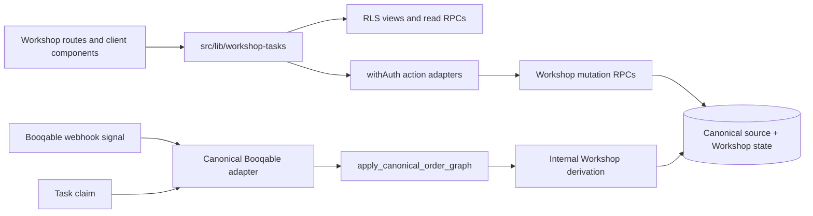
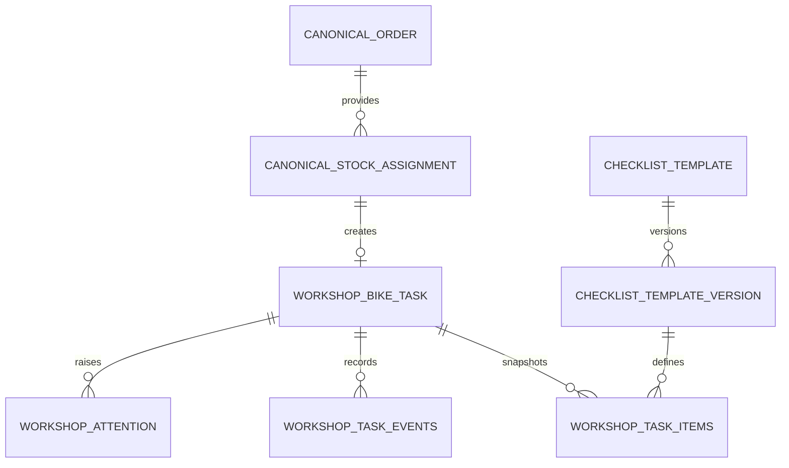
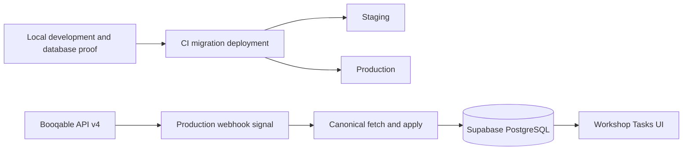

# Architecture Spine — Workshop Tasks

## Design Paradigm

**Transactional modular monolith.** Next.js owns responsive presentation and authenticated adapters; PostgreSQL owns atomic task mutations and durable attribution. Booqable is isolated behind the shipped canonical adapter and its approved, not-yet-live fetch-and-apply wiring. Workshop code consumes local canonical state and never parses webhook payloads or calls Booqable directly.

Target after the approved live-wiring story:



Dependencies point inward: routes depend on feature adapters; feature adapters depend on contracts and database capabilities; only the integration boundary depends on Booqable. PostgreSQL functions never call external HTTP.

## Invariants & Rules

### AD-1 — Keep Booqable and Workshop Tasks in separate modules [ADOPTED]

- **Binds:** FR-4..FR-6, FR-10, FR-15, FR-18, FR-21
- **Prevents:** task screens or workflow rules coupling to Booqable response and webhook shapes.
- **Rule:** `src/lib/booqable` alone fetches, validates, normalizes, and applies Booqable data. `src/lib/workshop-tasks` and `/workshop` consume local task/context contracts only.

### AD-2 — Put multi-record workflow changes behind database transactions [ADOPTED]

- **Binds:** FR-3, FR-6, FR-8, FR-11..FR-21; NFR-3, NFR-5
- **Prevents:** a Task Outcome, owner, snapshot, Item result, attention record, or history row changing without its required companion state.
- **Rule:** staff-initiated multi-row mutations are named PostgreSQL RPCs invoked only from `withAuth` actions; the action validates input, invokes the RPC, revalidates affected paths, and returns a discriminated result. AD-4's service-only source apply is the sole non-interactive exception and must invoke AD-5's internal derivation in its own transaction.

### AD-3 — Preserve one shared canonical Booqable projection [ADOPTED]

- **Binds:** FR-4..FR-6, FR-10, FR-15, FR-18, FR-21
- **Prevents:** a parallel Workshop copy of orders, a second source writer, or raw payload JSON becoming task state.
- **Rule:** after the approved live-wiring story, the shipped canonical projection and `apply_canonical_order_graph` are the sole Workshop Booqable-source boundary. Until then, the production webhook's documented legacy path remains `sync.ts`. Preserve existing shared consumers and `sync.ts`; the MVP adds no second projection, source writer, broad mirror, or raw-payload store. `booqable_*` projection tables are service-role-only; Workshop users receive task-scoped context through purpose-built Workshop reads only.

### AD-4 — Use one live fetch-and-apply boundary [ADOPTED]

- **Binds:** FR-10, FR-15, FR-18, FR-21
- **Prevents:** webhook and claim callers observing different Booqable state or treating a notification body as source truth.
- **Rule:** the approved live-wiring story makes a Booqable notification identify an order only, then refetch and apply current authority through the canonical adapter. The existing webhook continues to use `sync.ts` until that story is implemented and verified. A task claim performs the same refetch-and-apply before its claim RPC. The webhook logs a failed refresh with its contextual prefix and returns a retryable failure response; a claim returns `{ ok: false, error }` and makes no claim. Bounded synchronous transport retries and an explicit user resubmission of the original claim are allowed within the route budget; no durable queue, worker, sweep, hidden retry loop, or new manual repair API is allowed.

### AD-5 — Create tasks only from manager-assigned exact StockItems [ADOPTED]

- **Binds:** FR-4..FR-6, FR-9, FR-18
- **Prevents:** guessed tasks for quantity-only or ambiguous bikes, and source identity changing task history.
- **Rule:** `apply_canonical_order_graph` invokes one service-only internal Workshop derivation function in the same transaction for an accepted `applied` source result; no other source-triggered path may create, cancel, replace, or reconfirm a Bike Task. `applied` means all required derivation succeeds in that transaction; a missing active template, ambiguous association, duplicate StockItem association, or derivation error returns a typed failure and rolls back both canonical/task mutation rather than creating an empty or claimable task. A task is idempotently keyed by one Booqable rental/order plus one exact opaque StockItem ID; `stock_identifier` is display/confirmation data only. Unassigned, ambiguous, draft, new, and concept orders create no task. Order cancellation wins over all assignment changes and suppresses any successor creation. Otherwise, removal of an exact assignment without a replacement makes the current task `Cancelled`; a different assigned StockItem makes the prior task `Replaced` and creates a fresh task for the new StockItem. A formerly Cancelled or Replaced StockItem reappearing in the same rental creates no new task. Source cancellation, removal, or replacement never overwrites `Force-closed` or `Done`; an uncancelled different exact assignment may create its own fresh task after Force-close, while a post-Done source discrepancy only records the source fact. One StockItem associated with more than one admitted bike in a rental fails closed with no task mutation. A fresh replacement task has no copied attention and is discovered only through normal queue reads; no command returns a successor ID or traversal link. The original task retains its history; no provisional identity, replacement chain, automatic reactivation, overlap guard, or correction-successor model is introduced.

### AD-6 — Use a small Task Outcome and Work Phase model [ADOPTED]

- **Binds:** FR-6..FR-9, FR-12..FR-19
- **Prevents:** individual flows encoding incompatible lifecycle states or treating attention as a mechanical outcome.
- **Rule:** `Task Outcome` is `Actionable`, `Cancelled`, `Replaced`, `Force-closed`, or `Done`. An Actionable task has exactly one Work Phase: `Needs Prep`, `In Prep`, `Needs Re-check`, `In Re-check`, `Awaiting Return`, `Needs Return Check`, or `In Return Check`. Re-check is skipped when its Prep Snapshot has no M2 Items. Successful Prep resolution—direct handoff when there are no M2 Items or M2 completion—clears assignment, advances task revision, records history, and enters non-claimable `Awaiting Return`; it is in neither Available Now nor My Work, but its manager detail exposes phase, attention, and force-close only. Cancellation, assignment removal, replacement, force-close, and Done clear assignment atomically. A task first created from an already-returned rental snapshots both its active Prep and Return templates, records creation plus Return transition, and begins unassigned `Needs Return Check`. In one source apply, `Cancelled`, `Replaced`, and `Force-closed` take precedence over Return and create no Return Snapshot. Otherwise a returned Actionable task atomically clears any Prep/Re-check owner, creates one Return Snapshot for the source bike's current valid category, advances task revision, records the interrupted phase/owner, and becomes unassigned `Needs Return Check`; repeated returned refreshes are no-ops. Unknown, conflicting, or changed-invalid category tags fail closed without an arbitrary Return Snapshot. No Work Cycle, manager reset, or same-mechanic M2 override exists.

### AD-7 — Freeze template snapshots and role-specific Item outcomes [ADOPTED]

- **Binds:** FR-1..FR-3, FR-11..FR-14, FR-19
- **Prevents:** template changes rewriting in-progress work or M1 evidence satisfying M2 work.
- **Rule:** editable templates activate immutable Prep/Return versions per source category. Creation copies the active Prep version; making Return Check actionable copies the active Return version for the then-current valid source category. Action Items resolve as `Done` or `N/A`; Value Items record a value and never offer `N/A`. M2 configuration and attestation apply only to the Prep Snapshot: M2-enabled implies M1-enabled, M2 records a separate verification against M1's confirmed evidence, and M1 cannot edit Prep evidence after handoff. M1 is the authenticated actor of the accepted Prep handoff; reassigned Prep work may be completed by its new assignee, whose accepted handoff fixes M1 and the M2 exclusion identity. Return has one mechanic, no M2 stage, and no individual modification-acknowledgement engine.

### AD-8 — Keep current task state and attributable history together [ADOPTED]

- **Binds:** FR-6, FR-8, FR-11..FR-21; NFR-5
- **Prevents:** mutable current rows being the only answer to who acted, or history diverging from a successful mutation.
- **Rule:** task creation from an exact assignment and every accepted claim, Item outcome, handoff, re-check, reconfirmation, attention action, reassignment, force-close, cancellation, replacement, Return transition, and Done outcome write current state and an immutable attributed task-history event in the same transaction. The creation event records system source, source rental/order, opaque StockItem identity, initial category/template references, and resulting phase/outcome/revision. An interrupted Return-transition event records prior phase/owner and labels retained Prep/Re-check evidence as interrupted, never as Return evidence. Events contain task ID, monotonic per-task sequence, resulting task revision, actor XOR system source, occurrence time, type, and resulting phase/outcome/owner when changed. Normal application paths cannot edit or delete history.

### AD-9 — Use revisions and conditional claims for concurrent work [ADOPTED]

- **Binds:** FR-8, FR-11..FR-19, FR-22; NFR-3, NFR-4
- **Prevents:** two mechanics claiming one task or a stale screen overwriting owner, outcome, or current context.
- **Rule:** claims use one conditional database mutation so the first valid mechanic claimant wins. A `Needs Re-check` claim additionally requires the actor differ from recorded M1; M1's attempt returns unavailable/unauthorized without changing owner or phase. A claim that successfully refreshes must return exactly one of: claimed target; target transitioned with its current terminal/replaced state; target unavailable/unauthorized; or refresh failed. It never silently claims or redirects to another task. Every accepted mutation changing task owner, phase, outcome, Return eligibility, or reconfirmation obligation atomically increments task revision and writes AD-8 history; Item/Note evidence retains its scoped revision. Prep M1 outcomes and M2 attestations use role-scoped evidence revisions; completion locks and re-reads required confirmed evidence. Notes use their own expected revision plus current task owner/phase authorization in the same mutation. Mismatches return a typed authoritative state for refresh/retry.

### AD-10 — Keep attention and Notes orthogonal to mechanical completion [ADOPTED]

- **Binds:** FR-16, FR-17, FR-19, FR-20, FR-22
- **Prevents:** a manager exception blocking valid work, or a mutable Note becoming the audit record.
- **Rule:** Needs Attention is a separate, non-blocking record with a reason, raiser, resolution, and current owner context. Only `missing_or_unclear_bike_order_information` and `manager_decision_needed` are MVP mechanic reasons. One open record exists per `(task, reason)`; its reason is immutable, only system ownership-context updates are permitted while open, raise/resolve use its expected revision, a raise racing resolution creates a new open occurrence, and the Manager Attention List reads current open records only. An open record remains open through reassignment, Return, and terminal outcomes until an attributable manager resolution; every assignment-clearing transition atomically sets its current-owner context to null without creating another occurrence, while history retains the prior owner. An assigned mechanic in an Actionable phase or an Admin/Manager may raise attention; only Admin/Manager may resolve it. Reassignment is a phase-guarded manager RPC: it cannot assign a Re-check phase to recorded M1, increments task revision, records one owner change and its manager-supplied reason in one history event, and in `In Prep` requires the new owner to satisfy any open reconfirmation obligation. Force-close is permitted in any Actionable phase including `Awaiting Return` and likewise requires a manager-supplied reason. Notes are one mutable latest-value field, editable only by the current assigned mechanic in an Actionable phase or an Admin/Manager; observations belong in task history.

### AD-11 — Use RLS for reads and capability RPCs for writes [ADOPTED]

- **Binds:** FR-1, FR-7..FR-22; NFR-6
- **Prevents:** browser role checks authorizing work or direct writes bypassing transition and audit rules.
- **Rule:** Workshop users read RLS-protected views/read RPCs and mutate only through authenticated capability RPCs. A separate non-browser, service-only canonical apply capability alone may invoke the internal Workshop derivation function; it is not executable by clients and inserts a system-source history event. Server actions use `withAuth`; functions derive actor and role from authenticated context and use a fixed `search_path`. Claimable task ownership is mechanic-only; manager intervention assigns active work only to mechanics. Template create/edit/activate/supersede/reactivate capabilities are Admin/Manager-only. Prep outcome, reconfirmation, and handoff require current owner plus `In Prep`; M2 outcome/completion requires current owner plus `In Re-check` and an actor distinct from recorded M1; Return outcome/completion requires current owner plus `In Return Check`. Unassigned, terminal, and phase-mismatched commands are rejected unless a rule above grants an Admin/Manager exception. Partners receive no Workshop state. Task context exposes only task-scoped operational fields, never unrelated customer/order rows or contact/demographic PII.

### AD-12 — Serve database read models and URL-owned queue state [ADOPTED]

- **Binds:** FR-7, FR-10, FR-16, FR-20, FR-22; NFR-1..NFR-4
- **Prevents:** client aggregation becoming workflow truth or a read failure appearing as an empty queue.
- **Rule:** Available Now, My Work, Manager Attention, task detail, confirmed progress, and history come from database views/read RPCs. Open task detail reads context only while associated with that task's exact StockItem; terminal/replaced/cancelled detail renders the last associated context plus terminal/replacement facts. Loaders return data plus `error`; list pages surface failures. Queue filters, search, and pagination use URL parameters. Workshop is online-only: mutations require a live authenticated request and authoritative server confirmation; client storage may hold unsaved input only for the open session and may not queue/replay commands or present cached/offline tasks as claimable or completable. Frequent mechanic actions are tap-friendly on phones/tablets; manager template and intervention flows also support desktop. Realtime, if used, triggers an authoritative refresh only.

### AD-13 — Classify only from controlled source tags and reconfirm only active Prep [ADOPTED]

- **Binds:** FR-5, FR-10, FR-15
- **Prevents:** labels or titles choosing a template, and a source-change engine reopening work outside the MVP window.
- **Rule:** exactly one ProductGroup Workshop tag selects the category: `workshop-road-bike`, `workshop-e-road-bike`, `workshop-e-city-bike`, `workshop-gravel-bike`, `workshop-mtb-bike`, or `workshop-e-mtb-bike`. When the canonical source graph includes a bike Bundle, its matching `workshop-*-bike-bundle` tag must agree with that ProductGroup classification. Tags classify category only; they never replace exact StockItem identity. Untagged, unknown, multiple, or conflicting tags create no task; if they arise for an existing task, a cancellation or exact-assignment-removal transition still wins without category validation, while every other source apply returns a typed failure, leaves the last accepted task context/snapshot unchanged, and makes no queue/lifecycle mutation. The first invalid source failure writes one deduplicated system history event; identical repeats do not flood task history. On a relevant applied source change during `In Prep`, the source derivation boundary advances a monotonic reconfirmation generation and task revision, retains M1 assignment, and blocks handoff. M1 acknowledges the displayed generation, which records actor/time, clears only that obligation, and does not invalidate existing outcomes; Item changes use the ordinary save path before or after acknowledgement. Do not selectively invalidate Items or reopen work after handoff, Re-check, or preparation completion.

### AD-14 — Deliver live wiring incrementally through the existing operational envelope [ADOPTED]

- **Binds:** all
- **Prevents:** live wiring breaking existing Booqable consumers or migrations bypassing the repository deployment path.
- **Rule:** preserve the frozen shipped canonical layer, then implement and verify the single webhook/claim wiring story before dependent Workshop stories. Migrations are idempotent, verified against the local stack, and reach staging/production only through CI. Preview ingestion is denied at runtime even if preview deployments inherit credentials. Before live canonical wiring, record the actual Vercel execution model and bind a route-level total deadline for fetch, bounded retry, normalization, and apply; webhook work must fail fast, log context, and return a retryable failure inside that verified budget. Paper remains a local operating fallback, not a feature-controlled pilot or retirement gate.

### AD-15 — Require current authority before a claim [ADOPTED]

- **Binds:** FR-8, FR-10, FR-15, FR-18, FR-21
- **Prevents:** a mechanic claiming a task from stale local source context after an unavailable or changed Booqable order.
- **Rule:** a claim begins with AD-4's refetch-and-apply, then locks/re-reads and conditionally claims the displayed task from the resulting current local state. A source transition during refresh is returned with AD-9's explicit target result; it is never silently rebased or redirected. This flow does not mint/verify a signed freshness proof or create durable retry work.

### AD-16 — Treat the shipped canonical envelope as frozen MVP infrastructure [ADOPTED]

- **Binds:** FR-4..FR-6, FR-10, FR-15, FR-18, FR-21
- **Prevents:** new Workshop stories changing source-envelope semantics or creating an incompatible fetch profile.
- **Rule:** use the repository-owned canonical contracts, tag vocabulary, nested fetch profile, and `apply_canonical_order_graph` result contract as shipped. The approved live-wiring story invokes them; it does not extend `sync.ts`, change canonical source schemas, add code generation, or introduce a new adapter protocol. Its acceptance proof demonstrates that the webhook and claim path use this boundary rather than `sync.ts`.

### AD-17 — Preserve existing brownfield readers and local-customer behavior [ADOPTED]

- **Binds:** AD-3, AD-4, AD-14, FR-21
- **Prevents:** Workshop wiring changing bookings, order detail, partner reporting, or local-customer creation.
- **Rule:** frozen brownfield Booqable consumers retain their current selects, views, and local-customer semantics. New Workshop code reads its own task/context models and does not widen existing shared-reader contracts.

### AD-18 — Use one minimum task-context and history vocabulary [ADOPTED]

- **Binds:** FR-10, FR-15..FR-20; NFR-5, NFR-6
- **Prevents:** task screens, manager intervention, and history views displaying different operational facts or inventing event meanings.
- **Rule:** task context has one repository-owned shape for the stock identifier, category, rental timing, configuration, `extra_information`, current reconfirmation generation, Notes, and current task state. History event types are stable `snake_case` with AD-8's minimum envelope. Additive event fields/types require a compatible display fallback.

### AD-19 — Keep MVP rollout and recovery as operating practice [ADOPTED]

- **Binds:** all
- **Prevents:** independent stories adding activation epochs, cohorts, tenant scope, paper-retirement automation, or enterprise recovery systems.
- **Rule:** the MVP has no rollout/activation control plane, pilot cohort, tenancy model, retry worker, reconciliation sweep, new manual source/task repair API, or paper-retirement workflow. The temporary legacy bulk sandbox backfill route remains a documented exception until an explicitly approved removal/replacement; it must refetch through `sync.ts` and never directly repair source/task rows. Future needs for any of those capabilities require a new architecture decision rather than an implicit extension. Within this MVP, the approved PRD/spine supersede stale future-cutover scope in `project-context.md`; that context must receive a separately authorized alignment update before Workshop implementation.

## Consistency Conventions

| Concern | Convention |
| --- | --- |
| Modules | Route code is in `src/app/workshop`; feature actions/data/types are in `src/lib/workshop-tasks`; Booqable translation is in `src/lib/booqable`; database authority is in idempotent Supabase migrations/RPCs. |
| Naming | Workshop-owned database objects use `workshop_`; Booqable external identifiers remain opaque text; local database identifiers use UUIDs. |
| State | `Task Outcome` and `Work Phase` use the exact AD-6 vocabulary. Needs Attention and Notes never encode an outcome; source-driven reconfirmation uses the task's monotonic generation. |
| Results and errors | Actions use `{ ok: true, ... } | { ok: false, error }`; expected conflicts have stable codes; loaders return data plus `error`; unexpected failures use contextual `console.error` and friendly UI feedback. |
| Time and revisions | Persist UTC `timestamptz`; task and mutable evidence/Note revisions are monotonic integers. |
| UI confirmation | Every consequence-bearing control shows pending/error state, prevents duplicate submission, and reports success only from the confirmed server result. Failed Item saves retain the open-screen value for the current session only. |
| Queries and URL state | PostgreSQL owns eligibility, progress, sorting, and cross-table queries. Search, pagination, and queue filters are URL search parameters. |
| Security | `withAuth` guards server actions; RLS/capability RPCs enforce authorization; service-role credentials are limited to backend ingestion routes. |
| Migrations | Use idempotent DDL, drop-then-create RLS policies/triggers, fixed function `search_path`, local verification, and CI-only remote application. |

## Stack

| Name | Version |
| --- | --- |
| Next.js | 16.3.1 |
| React | 19.2.8 |
| Node.js | 24.x |
| TypeScript | 5.9.3 |
| PostgreSQL | 17 |
| `@supabase/supabase-js` | 2.102.1 |
| `@supabase/ssr` | 0.10.0 |
| Supabase CLI | 2.114.0 |
| `@subframe/core` | 1.154.0 |
| Zod | 4.4.3 |
| Booqable API | v4 |

Package versions are the current repository manifest pins or lockfile resolutions; PostgreSQL 17 is the required local target. Remote database/environment parity remains a CI/deployment proof, not asserted inventory.

## Structural Seed

```text
src/
  app/
    api/webhooks/booqable/               # signal-only live refresh entry point
    workshop/
      _components/                       # tablet-first mechanic and manager surfaces
      tasks/[taskId]/                    # focused Prep/Re-check/Return task screen
      page.tsx                           # Available Now / My Work with URL state
  lib/
    booqable/
      contracts/                         # frozen canonical source and tag contracts
      canonical-adapter.ts               # nested authority fetch/normalization
      sync.ts                            # existing brownfield writer; unchanged by MVP
    workshop-tasks/
      actions/                           # withAuth mutation adapters
      data/                              # views/read-RPC loaders
      types/                             # UI result and task-context contracts
supabase/
  migrations/                            # schema, RLS, views, RPCs, history triggers
  tests/database/workshop-tasks/         # pgTAP workflow and authorization proof
```



Target production topology after the approved live-wiring story:



## Capability → Architecture Map

| Capability / Area | Lives in | Governed by |
| --- | --- | --- |
| Templates and immutable snapshots — FR-1..FR-3 | template/version and task-Item models | AD-2, AD-7, AD-9, AD-11 |
| Manager-assigned task creation and category — FR-4..FR-6 | canonical assignment input and Bike Task creation RPC | AD-3..AD-6, AD-13, AD-16, AD-17 |
| Queue, claim, and independent bikes — FR-7..FR-9 | queue views and claim RPC | AD-2, AD-6, AD-9, AD-11, AD-12, AD-15 |
| Context, Prep, handoff — FR-10..FR-12 | task context loader and Item/transition RPCs | AD-2, AD-7..AD-9, AD-11, AD-12, AD-18 |
| Independent M2 — FR-13..FR-14 | role-scoped Item outcomes and claim rules | AD-6, AD-7, AD-9, AD-11 |
| Active-Prep reconfirmation — FR-15 | canonical apply derivation and task detail | AD-4, AD-6, AD-13, AD-15, AD-16 |
| Manager attention and intervention — FR-16..FR-17 | attention views and manager RPCs | AD-2, AD-8..AD-12, AD-18 |
| Return Check — FR-18..FR-19 | task transition, Return snapshot, Item outcomes | AD-2, AD-6..AD-9, AD-11 |
| Task history and current refresh — FR-20..FR-21 | history ledger, webhook and claim wiring | AD-3, AD-4, AD-8, AD-15..AD-18 |
| Shared Notes — FR-22 | task-scoped Notes read and mutation capability | AD-9..AD-12, AD-18 |
| Responsive confirmed-save UX — NFR-1..NFR-4 | routes, components, action contracts | AD-9, AD-12 |
| Audit and authorized access — NFR-5..NFR-7 | RLS, RPCs, history | AD-8, AD-11, AD-18 |

## Deferred

- **Relevant-change field list:** until UX/implementation narrows it, a change visible in the task context during `In Prep` is relevant and requires reconfirmation. The predicate is owned and fixture-tested at AD-5's source-derivation boundary, never recomputed by a UI loader.
- **Unassigned-bike visibility:** a manager-facing hint for a reserved order without an exact assigned StockItem may be added later, but it must not create a Bike Task.
- **PRD vocabulary correction:** the user-approved `Awaiting Return` Work Phase must be added to the PRD's Work Phase glossary and FR-12 consequence before story implementation.
- **Return surface for unfinished Prep:** UX may decide how much unfinished Prep appears inline versus history; AD-6's Return transition remains unchanged.
- **Source-identity and recovery platform:** provisional/multi-quantity identity, replacement chains, automatic reactivation, signed freshness proofs, retry/reconciliation infrastructure, correction successors, and new manual repair APIs are intentionally outside this MVP. The named legacy sandbox backfill exception is governed by AD-19.
- **Selective configuration engines:** accessory interpretation, Setup Category mapping, selective Item invalidation, and reopening after active Prep are future product/architecture work.
- **Broader operational controls:** activation epochs, pilot cohorts, tenancy, paper-retirement automation, performance analytics, and franchise reporting require a later product decision.
- **Project-context alignment:** the retained project context still includes superseded enterprise Workshop/Booqable scope. It must be reconciled to AD-19 before implementation; that source-maintenance change is outside this architecture-only update.
- **Detailed schema fields and indexes:** stories may choose ordinary attributes and indexes but may not weaken the ownership, state, snapshot, transaction, history, concurrency, or security rules above.
